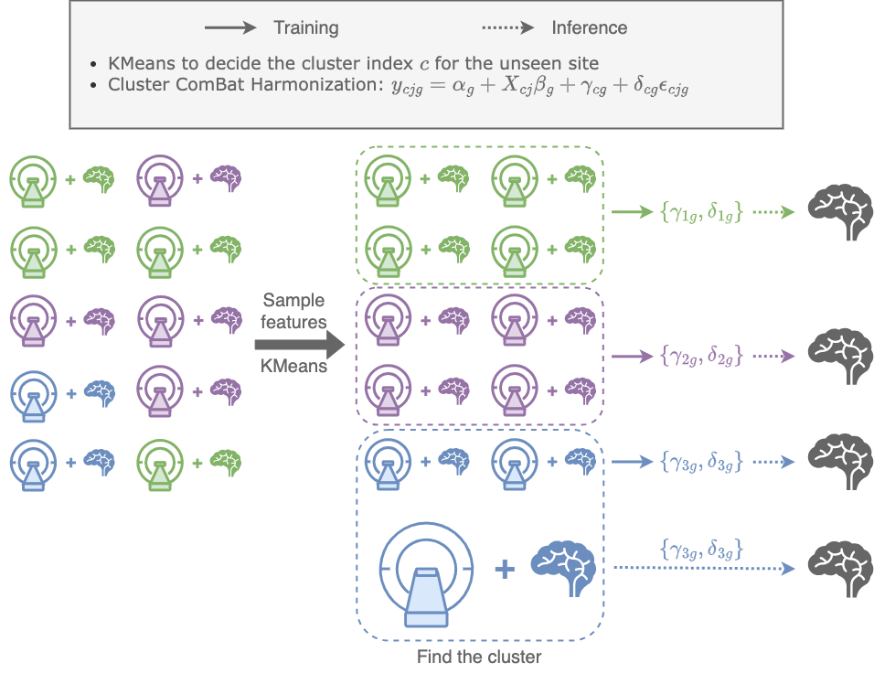
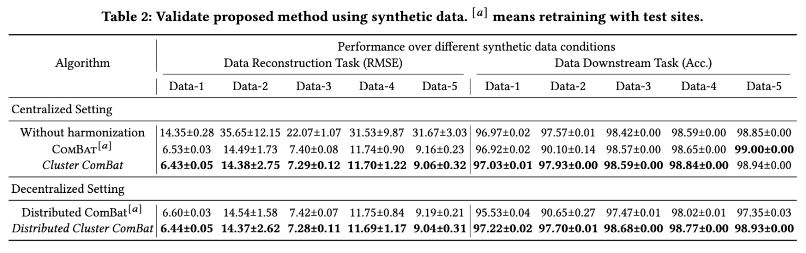

Distributed Harmonization: Federated Clustered Batch Effect Adjustment and Generalization
====================================================


Official Code for Paper: "Distributed Harmonization: Federated Clustered Batch Effect Adjustment and Generalization" Bao Hoang, Yijiang Pang, Siqi Liang, Liang Zhan, Paul Thompson, Jiayu Zhou, *KDD* 2024.

[](https://github.com/illidanlab/distributed-cluster-harmonization)
[](https://arxiv.org/abs/2405.15081)
[](https://opensource.org/licenses/MIT)

## Overview



Independent and identically distributed (i.i.d.) data is essential to many data analysis and modeling techniques. In the medical domain, collecting data from multiple sites or institutions is a common strategy that guarantees sufficient clinical diversity, determined by the decentralized nature of medical data. However, data from various sites are easily biased by the local environment or facilities, thereby violating the i.i.d. rule. A common strategy is to harmonize the site bias while retaining important biological information. The ComBat is among the most popular harmonization approaches and has recently been extended to handle distributed sites. However, when faced with situations involving newly joined sites in training or evaluating data from unknown/unseen sites, ComBat lacks compatibility and requires retraining with data from all the sites. The retraining leads to significant computational and logistic overhead that is usually prohibitive. In this work, we develop a novel Cluster ComBat harmonization algorithm, which leverages cluster patterns of the data in different sites and greatly advances the usability of ComBat harmonization. We use extensive simulation and real medical imaging data from ADNI to demonstrate the superiority of the proposed approach. Our codes are provided in https://github.com/illidanlab/distributed-cluster-harmonization.

## Package dependencies

Use `conda env create -f environment.yml` to create a conda env and
activate by `conda activate clusterComBat`. 

## Example
Here is example of how to use Cluster ComBat and Distributed Cluster Combat (example.py):

```python
import numpy as np
from sklearn.cluster import KMeans
from ClusterComBat.clusterComBat import ClusterComBat
from DistributedClusterComBat.distributedClusterComBat import DistributedClusterComBat

# Generate Random Data
number_of_sites_train = 10
number_of_features = 10
number_of_samples_train = 100
number_of_biological_covariates = 3
number_of_samples_test = 30

# Train
data_train = np.random.rand(number_of_samples_train, number_of_features)
batch = np.random.randint(low = 0, high = number_of_sites_train -1, size = number_of_samples_train)
covars_train = np.random.rand(number_of_samples_train, number_of_biological_covariates)

# Test
data_test = np.random.rand(number_of_samples_test, number_of_features)
covars_test = np.random.rand(number_of_samples_test, number_of_biological_covariates)

# Clustering Algorithm
kmean = KMeans()

# Cluster ComBat
clusterComBat = ClusterComBat(kmean)
harmonized_data_train = clusterComBat.fit(data_train, covars_train)
harmonized_data_test = clusterComBat.harmonize(data_test)

# Distributed Cluster ComBat
distributedClusterComBat = DistributedClusterComBat(kmean)
harmonized_data_train = distributedClusterComBat.fit(data_train, covars_train, batch)
harmonized_data_test = distributedClusterComBat.harmonize(data_test, covars_test)
```

## Demos


Here we provide several demos of synthetic data results from the paper. You can change the json file of synthetic data's configuration in the folder SyntheticDataConfig to plot figures, or perform classification and regression tasks on different synthetic dataset.

- **Reconstruction and Classification Task (Table 2 in the paper):**

    - Run `python synthetic_centralized.py` for centralized setting and `python synthetic_decentralized.py` for decentralized setting.

- **Plot Feature and Parameter distribution of synthetic data (Figure 3 in the paper):**

    - Run `python parameters_distribution.py`.

- **Plot Unharmonized, Harmonized, and Ground Truth of Synthetic Data (Figure 2 and 4 in the paper):**

    - Run `python synthetic_distribution.py`.

## References
[1] https://github.com/andy1764/Distributed-ComBat

[2] https://github.com/Jfortin1/neuroCombat/tree/ac82a067412078680973ddf72bd634d51deae735

## Acknowledgement
This material is based in part upon work supported by the National Science Foundation under Grant IIS-2212174, IIS-1749940, IIS 2319450, IIS 2045848, Office of Naval Research N00014-24-1-2168, and National Institute on Aging (NIA) RF1AG072449, U01AG068057, National Institute of Mental Health RF1MH125928.
